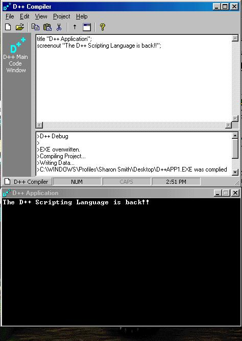



## D\+\+ Compiler

### Description

D++ is a scripting language that can handle things like basic I/O, if statements, variables, expression evalutaion, and more! It can compile the applications into executable files. Although it does NOT compile a true Win32 application, it compiles your source with a DLL to create a valid Win32 application by coping the DLL (blank app with built-in linker) and your source code and making a new EXE.
 
### More Info
 
D++ Source Code

D++ Customized Console Output

None that I know of. Please tell me if you find any.

             |
---                |---
**Submitted On**   |2000-10-01 11:33:14
**By**             |[Daniel Smith \(SqueakMac\)](https://github.com/Planet-Source-Code/PSCIndex/blob/master/ByAuthor/daniel-smith-squeakmac.md)
**Level**          |Advanced
**User Rating**    |3.7 (118 globes from 32 users)
**Compatibility**  |VB 5\.0, VB 6\.0
**Category**       |[Complete Applications](https://github.com/Planet-Source-Code/PSCIndex/blob/master/ByCategory/complete-applications__1-27.md)
**World**          |[Visual Basic](https://github.com/Planet-Source-Code/PSCIndex/blob/master/ByWorld/visual-basic.md)
**Archive File**   |[CODE\_UPLOAD103241012000\.zip](https://github.com/Planet-Source-Code/daniel-smith-squeakmac-d-compiler__1-11192/archive/master.zip)

